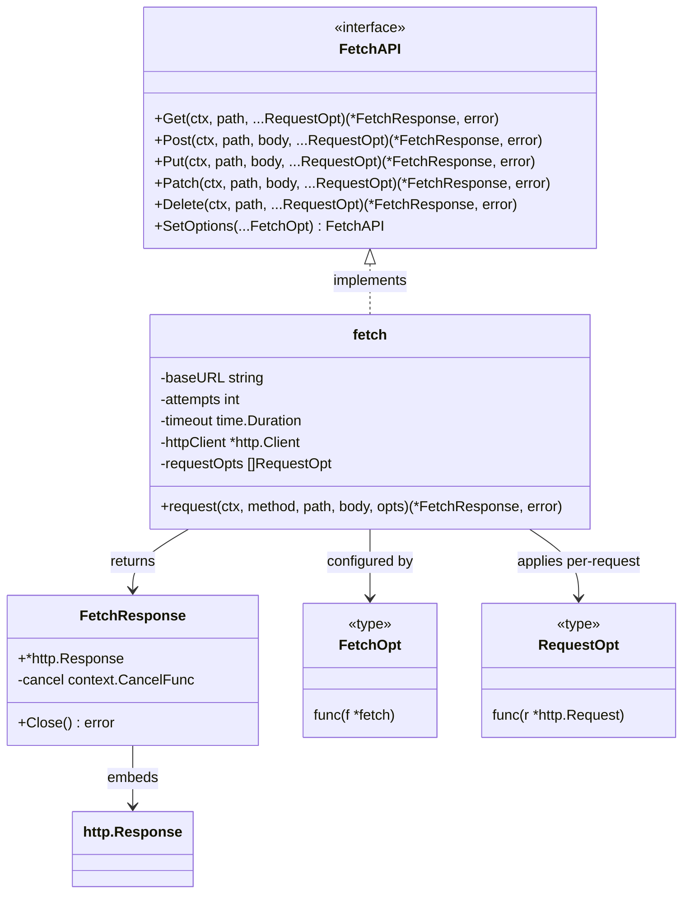
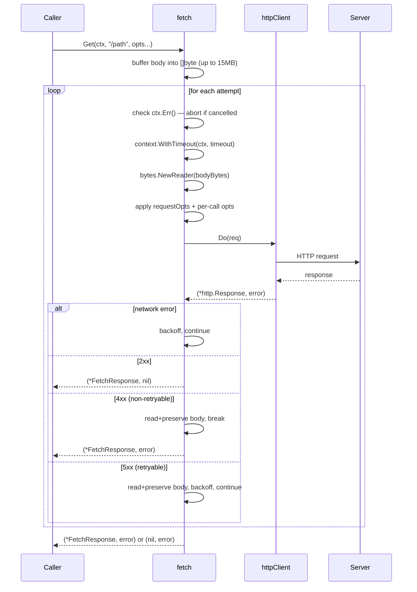
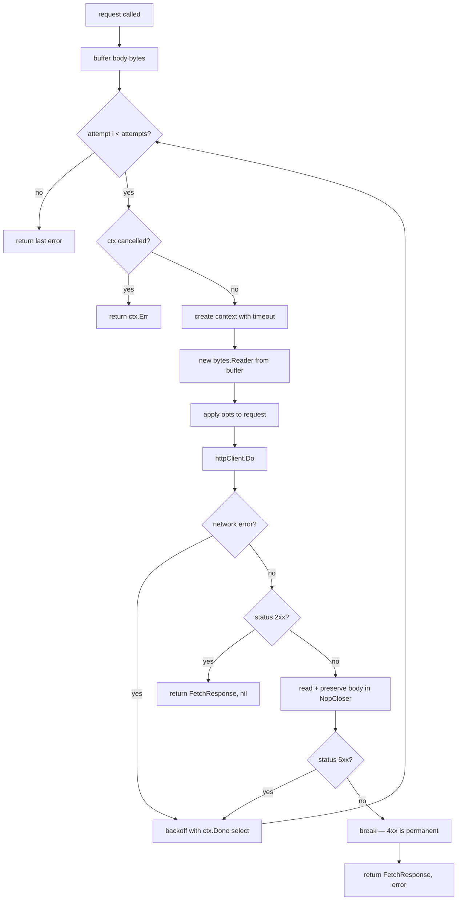

# go-fetch

HTTP client library for Go. Wraps `net/http` with retry, timeout, and request/response helpers.

Module: `github.com/luma-sys/go-fetch`

---

## Structure

```
go-fetch/
└── fetch/
    ├── fetch.go        # Core: FetchAPI interface, fetch struct, request loop
    ├── options.go      # RequestOpt constructors (headers, auth)
    ├── response.go     # FetchResponse type, Close, DecodeJSON
    └── encode.go       # EncodeData (struct → io.Reader)
```

---

## Type Relationships



---

## Request Lifecycle



---

## Retry Flow



---

## Configuration

### Client options (`FetchOpt`)

| Function                                | Effect                                                             |
| --------------------------------------- | ------------------------------------------------------------------ |
| `WithRetry(n int)`                      | Retry up to n times on 5xx + network errors. Negative clamped to 0 |
| `WithTimeout(d time.Duration)`          | Per-attempt context timeout                                        |
| `WithHTTPClient(*http.Client)`          | Custom HTTP client (transport, TLS, proxy, etc.)                   |
| `WithDefaultRequestOpts(...RequestOpt)` | Default opts applied to every request. Replaces prior defaults     |
| `WithDebugWriter(io.Writer)`            | Writes curl-equivalent per request. **Dev only** — exposes auth headers |

```go
client := fetch.New("https://api.example.com",
    fetch.WithRetry(3),
    fetch.WithTimeout(5*time.Second),
    fetch.WithDefaultRequestOpts(
        fetch.WithBearerToken(token),
        fetch.WithJsonBody(),
    ),
)

// debug only — never in production:
devClient := fetch.New("https://api.example.com", fetch.WithDebugWriter(os.Stderr))
```

### Per-request options (`RequestOpt`)

| Function                    | Effect                                      |
| --------------------------- | ------------------------------------------- |
| `WithHeader(key, value)`    | Adds HTTP header (appends via `Header.Add`) |
| `WithBasicAuth(user, pass)` | Sets Basic Auth credentials                 |
| `WithBearerToken(token)`    | Sets `Authorization: Bearer <token>`        |
| `WithJsonBody()`            | Sets `Content-Type: application/json`       |

```go
resp, err := client.Post(ctx, "/users", body,
    fetch.WithHeader("X-Request-ID", requestID),
)
```

### Branching client config

`SetOptions` returns a new `fetch` instance — original is unchanged:

```go
base    := fetch.New("https://api.example.com", fetch.WithRetry(2))
noRetry := base.SetOptions(fetch.WithRetry(0))
```

---

## Encoding / Decoding

```go
// struct → io.Reader for request body
body, err := fetch.EncodeData(myStruct)

// *FetchResponse → struct (closes body automatically)
result, err := fetch.DecodeJSON[MyStruct](resp)

// close without decoding (DELETE, 204, etc.)
defer resp.Close()
```

`EncodeData` uses `json.NewEncoder` — output includes trailing newline (`\n`).

`DecodeJSON` and `Close` drain + close `r.Body` and call cancel. Always call one of them.

---

## Design Decisions

**Body buffering**: `io.Reader` cannot be re-read. The library buffers the body into `[]byte` (up to 15MB) before the retry loop. Bodies larger than 15MB return an error immediately — they cannot be retried.

**Response body on non-2xx**: On non-2xx, the library reads the error body, replaces `r.Body` with a `NopCloser(bytes.NewReader(...))`, and returns `(*FetchResponse, error)`. Callers receive both the error AND the response so they can inspect the API error body. Always call `resp.Close()` or `fetch.DecodeJSON` even on error to release the context.

**Retry scope**: Only 5xx responses and network errors are retried. 4xx errors are permanent — retrying them is pointless and may have side effects (e.g., a 400 POST that partially creates state).

**Backoff**: Linear — `sleep = attempt_index × 100ms`. Backoff uses `select` with `ctx.Done()` so callers can cancel during wait. No jitter, no exponential growth.

**Transport**: Default transport is a tuned clone of `http.DefaultTransport`:

- `MaxIdleConns = 100`
- `MaxIdleConnsPerHost = 20`
- `IdleConnTimeout = 5min`

Override with `WithHTTPClient` for custom TLS, proxy, or test mocks.

**URL construction**: `baseURL + path` — simple string concatenation. If `baseURL` ends with `/` and `path` starts with `/`, double slash is produced. Callers must normalize.

**Debug curl output**: `WithDebugWriter` uses `github.com/moul/http2curl` to convert each `*http.Request` to a curl command before sending. `http2curl.GetCurlCommand` reads `req.Body`, so the library resets it via `req.GetBody()` afterwards — this works because `http.NewRequestWithContext` sets `GetBody` for `*bytes.Reader` bodies. Never use in production — output includes `Authorization` headers.

---

## Known Issues

None open. All previously identified issues resolved.

| Priority | Issue                                                                                | Status                |
| -------- | ------------------------------------------------------------------------------------ | --------------------- |
| P0       | Build broken — `response.go` imported `apoio-easy365-api/pkg/errors` not in `go.mod` | ✅ Fixed              |
| P1       | `WithRetry(-1)` → panic on nil `*http.Response`                                      | ✅ Fixed              |
| P1       | Retry fired on 4xx permanent errors                                                  | ✅ Fixed              |
| P1       | `time.Sleep` ignored context cancellation during backoff                             | ✅ Fixed              |
| P1       | `httpClient` was package-level mutable — race in parallel tests                      | ✅ Fixed              |
| P2       | No `context.Context` in public API                                                   | ✅ Fixed              |
| P2       | `fetchOpt` unexported                                                                | ✅ Fixed → `FetchOpt` |
| P2       | `log.Print` in library                                                               | ✅ Fixed              |
| P2       | `DecodeJSON` coupled to `errorx.ServerError` from unrelated app                      | ✅ Fixed              |
| P3       | Response body logged (PII/secrets risk)                                              | ✅ Fixed              |
| P3       | README outdated                                                                      | ✅ Fixed              |
| P3       | Makefile boilerplate wrong                                                           | ✅ Fixed              |
